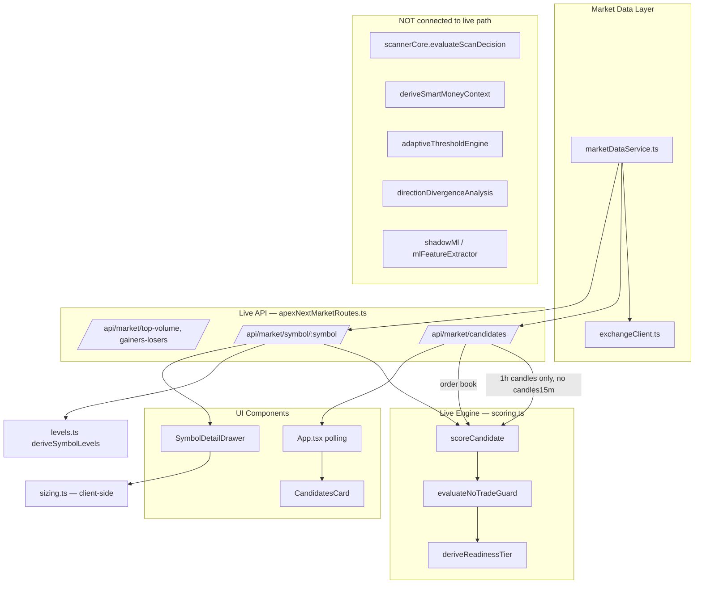
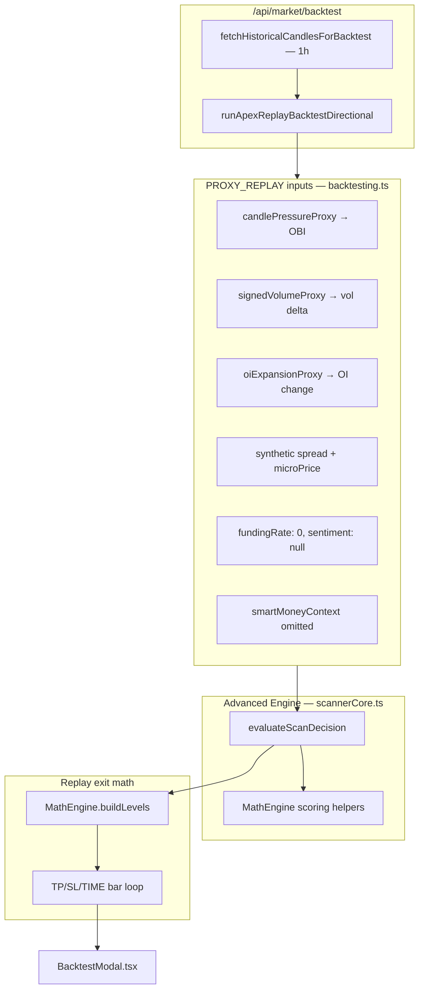
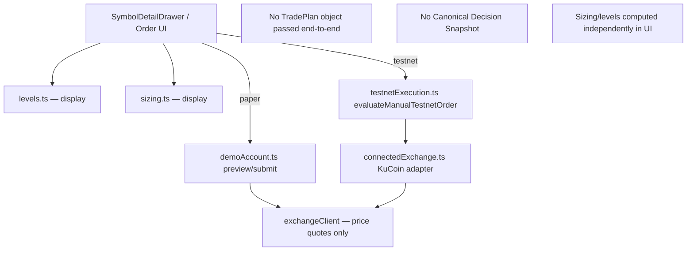
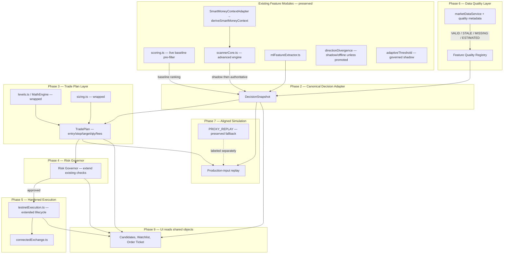

# APEX Trading Logic Upgrade — Phase 1 Inventory

Last updated: 2026-08-03  
Status: **Phase 1 complete** · **Phase 2 in progress** (canonical adapter + pre-migration fixes landed)

This document is the authoritative Phase 1 deliverable for the incremental trading-logic upgrade. It inventories what exists today, classifies each module, verifies confirmed source-audit findings, and shows the current flow versus the desired integrated flow.

## Phase 2 Progress (2026-08-03)

| Task | Status | Key files |
|------|--------|-----------|
| QStruct two-sided bounds + config normalization | Done | `scannerConfigPolicy.ts`, `scannerCore.ts` |
| Feature-quality metadata on live scoring | Done | `scoring.ts`, `types.ts` |
| Independent 15m/1h fetch + confluence semantics | Done | `scoring.ts`, `apexNextMarketRoutes.ts` |
| ROC momentum rename (MACD alias preserved) | Done | `scoring.ts` |
| SmartMoneyContextAdapter + availability states | Done | `smartMoneyContextAdapter.ts` |
| Canonical Decision Adapter + live shadow | Done | `canonicalDecisionAdapter.ts`, routes |
| PROXY_REPLAY label + SMC + effective weights | Done | `backtesting.ts` |
| Direction asymmetry (LONG_ONLY, symmetric SMC) | Done | `scannerCore.ts`, `types.ts` |
| Shadow comparison logging | Done | `decisionSnapshotLogger.ts`, `shadowComparisonPersistence.ts`, routes, `App.tsx` |
| Trade Plan layer (initial) | Done | `tradePlan.ts`, symbol API `tradePlanLong`/`tradePlanShort` |
| Risk Governor / execution hardening | Pending | Phases 4–5 |

**Live authority:** `scoreCandidate` ranking remains authoritative. Advanced engine runs in **shadow** on candidates/symbol routes (`includeShadow=1` default).

**Backtest:** Returns `replayMode: PROXY_REPLAY` with explicit disclaimer.

Related plans: [`PROJECT_UPGRADE_PLAN.md`](PROJECT_UPGRADE_PLAN.md), user-provided **APEX Incremental Trading Logic Upgrade Plan**.

---

## 1. Executive Summary

APEX currently runs **two non-comparable decision engines**:

| Engine | Module | Live? | Primary consumers |
|--------|--------|-------|-------------------|
| **Lightweight live scanner** | `src/lib/scoring.ts` → `scoreCandidate` | **Yes** | `/api/market/candidates`, `/api/market/symbol/:symbol`, UI cards |
| **ATLAS-style advanced engine** | `src/services/scannerCore.ts` → `evaluateScanDecision` | **No (live)** | `backtesting.ts`, offline stress scripts |

Advanced modules (Smart Money Context derivation, adaptive thresholds, direction-divergence analysis, shadow ML, structural zones) are implemented but largely **disconnected from live execution**. Backtesting uses **proxy inputs** derived from hourly candles, not production microstructure.

The upgrade strategy is **inspect → strengthen → connect → add safeguards**. Neither engine is deleted in Phase 1.

---

## 2. Module Inventory

Classification key:

| Tag | Meaning |
|-----|---------|
| **LIVE** | Used in live UI/API path today |
| **REPLAY** | Used only in backtest/replay or offline scripts |
| **SHARED** | Shared utility consumed by multiple paths |
| **EXPERIMENTAL** | Shadow/offline analytics; not a live gate |
| **DUPLICATED** | Overlapping responsibility with another module |
| **UNUSED** | Implemented but no production/replay consumer |

### 2.1 Candidate Ranking & Signal Generation

| Module | Key exports | Classification | Consumers |
|--------|-------------|----------------|-----------|
| `src/lib/scoring.ts` | `scoreCandidate`, `calculateRsi`, `computeMacdSignal`, `classifyStructure`, `evaluateNoTradeGuard`, `deriveReadinessTier` | **LIVE**, **SHARED** | `apexNextMarketRoutes.ts` (candidates, symbol detail), `levels.ts` (RSI import), `src/test/scoring.test.ts` |
| `src/services/scannerCore.ts` | `evaluateScanDecision`, `evaluateScanCandidate`, `selectScanSlice`, `pickBestCandidate` | **REPLAY**, **DUPLICATED** | `backtesting.ts`, `scripts/utilities/runHundredSeedLoadMatrix.mts`, `runFastMinuteMatrix.mts`, `runSyntheticDecisionAudit.mts`; types only in `src/types.ts` |
| `src/services/apexNextMarketRoutes.ts` | `registerApexNextMarketRoutes` | **LIVE** | `server.ts`, QA scripts |

### 2.2 Market Direction & Structure

| Module | Key exports | Classification | Consumers |
|--------|-------------|----------------|-----------|
| `src/services/mathEngine.ts` | `calculateQStructDirectional`, `calculateDirectionalRawScore`, `buildLevels`, `calculateATR`, evidence/squeeze helpers | **SHARED** (REPLAY-heavy) | `scannerCore.ts`, `backtesting.ts`, `marketDataService.ts`, `rejectedCandidateReplay.ts`, offline scripts |
| `src/services/smartMoneyContextEngine.ts` | `deriveSmartMoneyContext`, `smcAlignmentForDirection` | **PARTIAL** — alignment helper used; derivation **UNUSED** | `smcAlignmentForDirection` → `scannerCore.ts` only; `deriveSmartMoneyContext` → **no importers** |
| `src/services/directionDivergenceAnalysis.ts` | `analyzeDirectionDivergenceRows`, `classifyDirectionDivergence`, gate helpers | **EXPERIMENTAL** | `scripts/utilities/analyzeDirectionDivergence.mts`, tests; header states not a live gate |

### 2.3 Technical Indicators (Live Path)

| Function | Location | Notes |
|----------|----------|-------|
| RSI (14) | `scoring.ts` `calculateRsi` | Live |
| "MACD" (actually 5-bar ROC) | `scoring.ts` `computeMacdSignal` | Live — misnamed |
| Swing structure | `scoring.ts` `classifyStructure` | Live |
| ATR | `levels.ts` `calculateAtr`, `mathEngine.ts` `calculateATR` | **DUPLICATED** |
| QStruct directional | `mathEngine.ts` | Live display via `fetchMicrostructure`; **not** fed into `scoreCandidate` |

### 2.4 ML Feature Extraction & Shadow ML

| Module | Key exports | Classification | Consumers |
|--------|-------------|----------------|-----------|
| `src/services/mlFeatureExtractor.ts` | `extractFeatures`, `inspectMlFeatureCompleteness`, `ML_FEATURE_VERSION`, `ML_FEATURE_NAMES`, `isLeakageExcludedFeature` | **EXPERIMENTAL** | `shadowMlModel.ts`, `shadowMlComparison.ts`, `shadowMlTraining.ts`, `mlDatasetPreparation.ts`, export scripts, tests |
| `src/services/shadowMlModel.ts` | Shadow scoring | **EXPERIMENTAL** | Shadow pipeline only |
| `src/services/shadowMlTraining.ts` | Training scaffold | **EXPERIMENTAL** | Ops/automation; audit-only |
| `src/services/adaptiveThresholdEngine.ts` | `deriveAdaptiveScannerConfig`, `summarizeAdaptiveExperience` | **EXPERIMENTAL** (stress-only) | `adaptiveLearningStress.ts`, offline matrix scripts, tests |

### 2.5 Entry, Stop, Target & Sizing

| Module | Key exports | Classification | Consumers |
|--------|-------------|----------------|-----------|
| `src/lib/levels.ts` | `deriveSymbolLevels`, `calculateAtr` | **LIVE** | `apexNextMarketRoutes.ts` (symbol detail), `SymbolDetailDrawer` via API |
| `src/lib/sizing.ts` | `calculatePositionSizing` | **LIVE** (display only) | `SymbolDetailDrawer.tsx` — client-side recalculation |
| `src/services/mathEngine.ts` | `buildLevels(entry, atr, direction)` | **REPLAY** | `backtesting.ts`, `rejectedCandidateReplay.ts` |

**Duplication note:** Live UI uses ATR-band/swing levels in `levels.ts`; replay uses fixed ATR multiples in `MathEngine.buildLevels`. They are not unified.

### 2.6 Risk Validation

| Module | Checks | Classification |
|--------|--------|----------------|
| `scoring.ts` `evaluateNoTradeGuard` | Data state, liquidity floor, book depth, funding squeeze, TF confluence | **LIVE** |
| `scannerCore.ts` `evaluateScanDecision` | Liquidity quality, squeeze, evidence agreement, SMC opposition, min confidence | **REPLAY only** |
| `testnetExecution.ts` `evaluateManualTestnetOrder` | Symbol allowlist, qty/tick alignment, max open orders, min margin, max notional | **LIVE** (testnet) |
| `connectedExchange.ts` `previewLiveOrder` | Session notional ceiling, margin | **LIVE** (KuCoin session) |
| `demoAccount.ts` `preview` | Session notional, margin vs balance | **LIVE** (paper) |

No central **Risk Governor** exists yet; checks are distributed.

### 2.7 Paper Trading, Backtesting & Execution

| Module | Classification | Consumers |
|--------|----------------|-----------|
| `demoAccount.ts` | **LIVE** (paper) | `server.ts` `/api/account/*`, `App.tsx`, account views |
| `backtesting.ts` | **REPLAY** (+ live API endpoint) | `apexNextMarketRoutes.ts` `/api/market/backtest`, `BacktestModal.tsx` |
| `testnetExecution.ts` | **LIVE** (testnet lifecycle) | `server.ts`, `connectedExchange.ts` |
| `connectedExchange.ts` | **LIVE** (KuCoin authenticated) | `server.ts` live order routes |
| `exchangeClient.ts` + `marketDataService.ts` | **SHARED** | All market routes, demo, connected exchange |

### 2.8 Decision Memory & Observability

| Module | Classification | Consumers |
|--------|----------------|-----------|
| `decisionMemory.ts` | **LIVE** (browser-local) | UI decision journal; optional mirror |
| `decisionMemoryMirror.ts` | **SHARED** | Backend mirror queue |
| `operationsStatus.ts` | **LIVE** | System health / ops dashboard |

`SignalDecisionLog` type exists and is used by shadow ML and adaptive tooling, but **live `scoreCandidate` does not write structured decision logs** with engine traces today.

### 2.9 Offline / Unused Advanced Modules

| Module | Classification | Evidence |
|--------|----------------|----------|
| `deriveSmartMoneyContext` | **UNUSED** (derivation) | Zero importers outside `smartMoneyContextEngine.ts` |
| `MathEngine.detectStructuralZones` | **UNUSED** | Defined `mathEngine.ts:441`; zero call sites |
| `directionDivergenceAnalysis.ts` | **EXPERIMENTAL** | Script + tests only |
| `adaptiveThresholdEngine.ts` | **EXPERIMENTAL** | Stress harness + scripts; not authoritative live config |
| `rejectedCandidateReplay.ts` | **EXPERIMENTAL** | Offline replay script |

---

## 3. Current Architecture Flow

### 3.1 Live Candidate Path (Production UI)



**Live inputs to `scoreCandidate` today:**
- Ticker (price, funding, turnover, dataState)
- ~30 × **1h candles** (default `fetchCandlesForSymbol`)
- Order book summary (bid/ask depth, imbalance)
- **No** independent 15m series
- **No** SMC, OBI smoothing, signed volume delta, OI expansion, micro-price

**Live outputs:** `CandidateScore` — score 0–100, readiness tier, guard reasons, component breakdown.

### 3.2 Replay / Backtest Path



**Strategy label in summary:** `APEX_REPLAY` (proxy mode). Not comparable to live `scoreCandidate` results.

### 3.3 Execution Path (Manual / Paper / Testnet)



---

## 4. Desired Integrated Architecture (Target State)

Phases 2–9 connect existing modules through adapters — **no wholesale replacement**.



**Migration principles:**
1. `scoreCandidate` remains live baseline until shadow parity gates pass.
2. `evaluateScanDecision` runs in **shadow** on same live candidates before promotion.
3. Replay migrates to canonical path; proxy replay kept as `PROXY_REPLAY`.
4. Manual trading stays functional throughout.

---

## 5. Confirmed Audit Findings — Source Verification

All findings below were re-verified against the current codebase on 2026-08-03.

### P0 — Two separate strategy engines

| Aspect | Live (`scoring.ts`) | Replay (`scannerCore.ts`) |
|--------|---------------------|---------------------------|
| Entry point | `scoreCandidate` | `evaluateScanDecision` |
| Route | `apexNextMarketRoutes.ts:373-374` | `backtesting.ts:340-346` |
| Signals | RSI, ROC-as-MACD, structure, OBI%, funding, liquidity | OBI, QStruct, vol delta, funding bias, OI, ATR, micro-price, evidence, squeeze, SMC slot |
| Output | Score 0–100 + readiness tier | Confidence 0–1 + gate trace |
| Comparable? | **No** | **No** |

**UI mislabel:** `BacktestModal.tsx:3-4` claims "exact same readiness-tier and level code path used live" — **incorrect**. Backtest uses `scannerCore` + `MathEngine.buildLevels`, not `scoreCandidate` + `deriveReadinessTier`.

### P0 — Smart Money Context disconnected

- `deriveSmartMoneyContext` exported at `smartMoneyContextEngine.ts:243` — **zero consumers**.
- `scannerCore.ts:108,167,212-213` accepts optional `smartMoneyContext`; defaults `smcDirectionalScore` to `0`, `smcContextScore` to `0.5`.
- `backtesting.ts:340-346,452-458` never passes `smartMoneyContext`.
- SMC rejection rules (`scannerCore.ts:237-254`) are **not exercised** in replay.

### P0 — Backtesting uses proxies

From `backtesting.ts:325-346`:

| Production input | Replay substitute |
|------------------|-------------------|
| Order-book OBI | `candlePressureProxy(c)` |
| Signed volume delta | `signedVolumeProxy(...)` |
| Open interest expansion | `oiExpansionProxy(...)` |
| Spread | `max(close * 0.00035, atr * 0.025)` |
| Micro-price | `close + pressure * spread * 0.5` |
| Funding | hardcoded `0` |
| Sentiment | hardcoded `null` |
| Smart Money Context | omitted |

**Required label:** `PROXY_REPLAY` (currently summarized as strategy `'APEX_REPLAY'`).

### P1 — False multi-timeframe confluence

- `scoreCandidate` supports `candles15m` (`scoring.ts:223-229`).
- Live route passes only default 1h candles (`apexNextMarketRoutes.ts:373-374`; `fetchCandlesForSymbol` default `'1h'`, limit 30).
- When `candles15m` absent: `tf15m` falls back to same-series `macd` (`scoring.ts:223-225`).
- Confluence uses directional **OR** logic (`scoring.ts:227-229`): bullish 15m **or** bullish 1h structure suffices for LONG alignment.
- `fetchMicrostructure` (`apexNextMarketRoutes.ts:229-268`) fetches 1m/5m/15m for **qStruct display only** — not scoring.

### P1 — `computeMacdSignal` is not MACD

```41:48:src/lib/scoring.ts
export function computeMacdSignal(candles: Candle[]): 'BULLISH' | 'BEARISH' | 'NEUTRAL' {
  if (!candles || candles.length < 26) return 'NEUTRAL';
  const last = candles[candles.length - 1].close;
  const prev = candles[candles.length - 5].close;
  const roc = ((last - prev) / prev) * 100;
  ...
}
```

Five-bar rate-of-change with ±0.5% thresholds — not EMA(12/26) + signal line.

### P1 — Missing data → neutral-looking values

| Location | Behavior |
|----------|----------|
| `scoring.ts:23` | RSI → `50` if insufficient history |
| `scoring.ts:42,59` | MACD/structure → `NEUTRAL` |
| `scoring.ts:156,174,187,201` | Component scores start at `50` |
| `scoring.ts:175,188` | Missing OBI/funding → `\|\| 0` |
| `levels.ts:49` | ATR fallback → `currentPrice * 0.018` |
| `scannerCore.ts:213` | Missing SMC → neutral `0.5` alignment |

### P1 — QStruct hidden bounds

```117:119:src/services/scannerCore.ts
  const qStructThreshold = Math.min(cfg.qStructThreshold ?? -0.20, -0.30);
```

Forces threshold ≤ −0.30 regardless of looser config (e.g. `DEFAULT_SCANNER_CONFIG.qStructThreshold: -0.30` in `apexNextMarketRoutes.ts:19`). No lower-bound clamp; adaptive engine documents range `[-0.52, -0.30]`.

### P1 — Backtesting SMC weight cap

```308:312:src/services/backtesting.ts
  scoreWeights: MathEngine.normalizeScoreWeights({
    ...opts.scannerConfig.scoreWeights,
    smc: Math.min(opts.scannerConfig.scoreWeights?.smc ?? 0.05, 0.03)
  }),
```

Same cap in LONG path (`backtesting.ts:423`). Invisible override; not persisted in replay output.

### P1 — Direction asymmetry

| Issue | Location |
|-------|----------|
| `ScannerConfig.directionBias`: `SHORT_ONLY` \| `BOTH` only — no `LONG_ONLY` | `types.ts`, `backtesting.ts:395-397` comment |
| BOTH mode: SHORT selected first (`scannerCore.ts:143-144`) | Can suppress LONG when both gates pass |
| LONG replay uses BOTH + filter (`backtesting.ts:420-424`) | SHORT priority affects LONG discovery |
| SMC hard reject for SHORT only (`scannerCore.ts:241-246`) | No mirrored LONG rule |
| Rejection text "short execution" (`scannerCore.ts:225`) | Hardcoded even when direction varies |

### P2 — Offline advanced modules

| Module | Role today | Recommended classification |
|--------|------------|----------------------------|
| `directionDivergenceAnalysis.ts` | Offline dataset analysis | **Offline analytics** — keep shadow-only |
| `adaptiveThresholdEngine.ts` | Stress harness proposals | **Stress-only** — add governance before live |
| `MathEngine.detectStructuralZones` | No consumers | **Planned/offline** — confirm obsolete or wire to SMC |
| `deriveSmartMoneyContext` | No consumers | **Planned** — Phase 2 adapter target |
| Shadow ML stack | Audit-only | **Experimental shadow** — no live gate |

---

## 6. Preserved Foundations (Do Not Rebuild)

### 6.1 Testnet execution lifecycle

`testnetExecution.ts` defines:

**Order states:** `VALIDATING`, `RISK_REJECTED`, `SUBMITTING`, `ACKNOWLEDGED`, `PARTIALLY_FILLED`, `FILLED`, `CANCEL_PENDING`, `CANCELLED`, `REJECTED`, `UNKNOWN`, `RECONCILING`

**Validation states:** `VALIDATING_LOCALLY`, `RISK_REJECTED`, `SUBMITTING_VALIDATION`, `VALIDATED`, `EXCHANGE_REJECTED`, `VALIDATION_FAILED`, `VALIDATION_UNKNOWN`

Upgrade must **extend** this model (persistence, reconciliation, fill records) — not replace it.

### 6.2 ML feature extraction

`mlFeatureExtractor.ts` provides versioned schema (`ML_FEATURE_VERSION`), feature registry (`ML_FEATURE_NAMES`), completeness inspection, leakage exclusions. Upgrade adds governance around this extractor; does not replace it.

**Audit note:** `smcDirectionalScore` appears via both `log.*` and `smartMoneyContext.*` paths — semantic duplication to resolve in Phase 2/8.

### 6.3 Adaptive threshold engine

`adaptiveThresholdEngine.ts` already clamps, bounds (0.01–0.60 per weight), normalizes, and confidence-scales proposals. Upgrade adds promotion gates and audit history — not a second engine.

---

## 7. Consumer Map — Decision Engines

### 7.1 `scoreCandidate` consumers

| Consumer | File | Usage |
|----------|------|-------|
| Live candidates API | `apexNextMarketRoutes.ts:373-374` | Rank LONG/SHORT lists |
| Symbol detail API | `apexNextMarketRoutes.ts:425-426` | `scoreLong`, `scoreShort` |
| UI polling | `App.tsx:226` | Fetches `/api/market/candidates` |
| Candidates card | `CandidatesCard.tsx` | Displays ranked candidates |
| Symbol drawer | `SymbolDetailDrawer.tsx:93` | Uses `scoreLong`/`scoreShort` for active direction |
| Unit tests | `src/test/scoring.test.ts` | Regression |

### 7.2 `evaluateScanDecision` consumers

| Consumer | File | Usage |
|----------|------|-------|
| SHORT replay | `backtesting.ts:340` | Proxy-input decisions |
| LONG replay | `backtesting.ts:452` | Proxy-input decisions |
| Load matrix scripts | `runHundredSeedLoadMatrix.mts`, `runFastMinuteMatrix.mts` | Stress testing |
| Synthetic audit | `runSyntheticDecisionAudit.mts` | Decision audit |
| Indirect | `scannerCore.ts:304` | Via `evaluateScanCandidate` |

**Not consumed by:** any live route, UI component, or paper/testnet execution path.

---

## 8. Recommended Execution Order (Phases 2+)

Aligned with the master upgrade plan:

1. ~~Existing trading-logic inventory~~ **(this document)**
2. Document live vs replay engine behavior — **done in §3–§5**
3. Effective-configuration normalization + QStruct two-sided bounds
4. Structured feature-quality states on live scoring path
5. Correct live 15m/1h acquisition + confluence semantics
6. Version/rename ROC-as-MACD feature
7. Connect `deriveSmartMoneyContext` via adapter
8. SMC in advanced live shadow evaluation
9. SMC in replay + expose effective weights
10. Label/preserve PROXY_REPLAY; add production-input replay
11. Resolve LONG/SHORT direction asymmetry
12. Audit `testnetExecution.ts` lifecycle coverage
13. Audit `mlFeatureExtractor.ts` duplication + completeness
14. Audit `adaptiveThresholdEngine.ts` bounds + audit records
15. **Canonical Decision Adapter** (Phase 2)
16. Trade Plan → Risk Governor → Execution hardening → …

---

## 9. Phase 1 Deliverables

### Completed

- Full module inventory with classification (§2)
- Current vs desired flow diagrams (§3–§4)
- All P0/P1/P2 audit findings verified with file references (§5)
- Consumer maps for both engines (§7)
- Preserved-foundation notes for execution, ML, adaptive thresholds (§6)

### Files added

| File | Purpose |
|------|---------|
| `Doc/plans/active/TRADING_LOGIC_UPGRADE_PHASE1_INVENTORY.md` | This document |

### Files modified

None — Phase 1 is documentation-only per upgrade rules.

### Architectural decisions

1. **Dual-engine coexistence** — Both `scoring.ts` and `scannerCore.ts` remain until canonical adapter + shadow parity gates pass.
2. **Adapter-first integration** — New interfaces wrap existing modules; no broad refactors in Phase 1.
3. **PROXY_REPLAY preservation** — Current backtest remains a labeled fallback, not deleted when production-input replay is added.
4. **Manual trading first** — No autonomous live trading until Phases 4–5 complete.

### Known limitations (unchanged after Phase 1)

- Live and replay strategies are not comparable.
- BacktestModal UI copy overstates parity with live scoring.
- SMC, adaptive thresholds, divergence analysis, and shadow ML are not in the live decision path.
- UI independently computes sizing from API levels — no shared TradePlan.
- Missing market inputs can appear as neutral evidence in live scoring.

---

## 10. Next Step — Phase 2 Preview

Phase 2 introduces `DecisionSnapshot` and the **Canonical Decision Adapter** that:

1. Normalizes outputs from `scoreCandidate` (baseline) and `evaluateScanDecision` (shadow).
2. Attaches feature-quality metadata and engine version.
3. Runs advanced engine in parallel on live candidates without changing authoritative ranking initially.
4. Logs comparisons to `SignalDecisionLog` / decision memory for parity analysis.

No live route migration occurs until shadow comparison thresholds are met.
