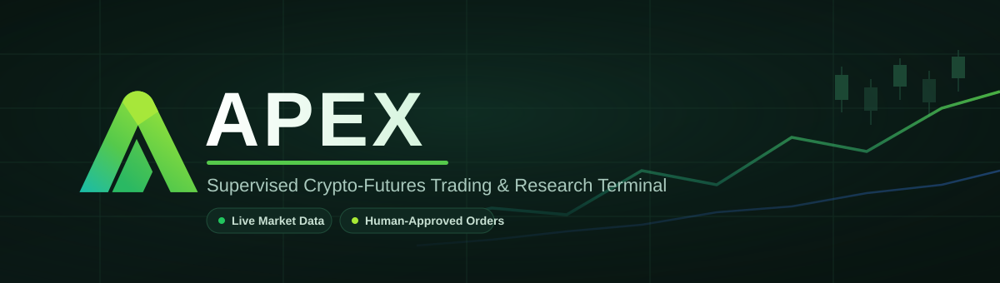
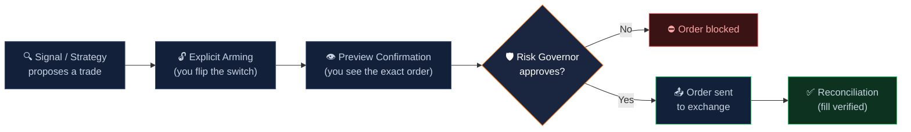
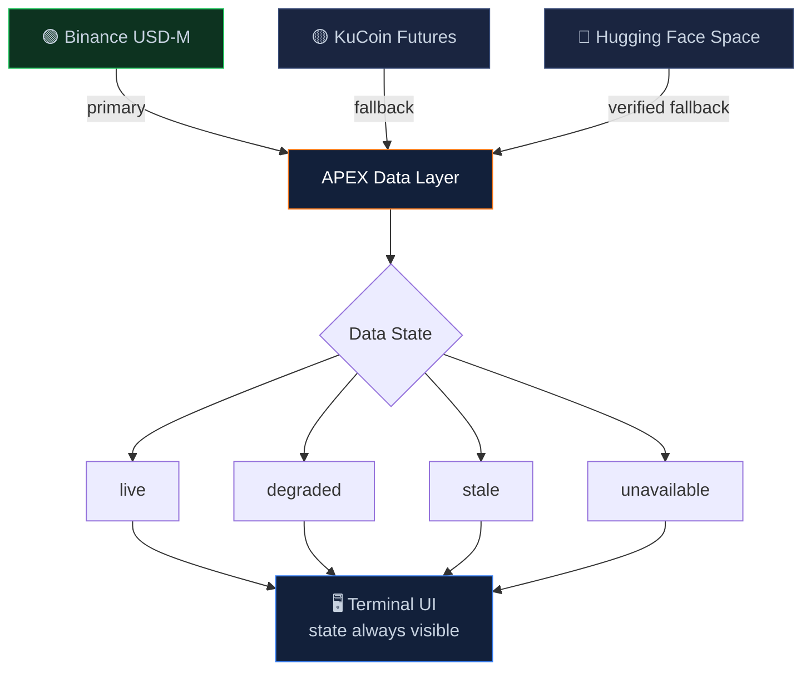

<div align="center">



<br/>


**A local-first control room for market research, strategy backtesting, and manually supervised order execution — built to make every decision explainable, and no live order fireable without a human in the loop.**

</div>

---

## 🗺️ Contents

- [What APEX Is](#what-apex-is)
- [What APEX Is *Not*](#what-apex-is-not)
- [Under the Hood](#-under-the-hood)
- [Data You Can Trust](#-data-you-can-trust)
- [Quick Start](#-quick-start)
- [Requirements](#requirements)
- [Safety & Network Posture](#safety--network-posture)
- [Project Layout](#-project-layout)
- [Documentation](#-documentation)

---

## What APEX Is

APEX pairs a **React 19 / Vite** frontend with a **Node.js / Express / TypeScript** backend to give you one terminal for:

- 📡 **Live market intelligence** — real-time price, order-book, funding, open-interest, and news/sentiment data
- 🔬 **Strategy research & backtesting** — walk-forward validation against sealed historical holdouts, not just in-sample curve-fitting
- 🧪 **Paper trading & shadow evaluation** — trial new strategies risk-free before they ever get near a real order
- 🛡️ **Manually supervised live execution** — when you're ready, APEX prepares the order; you approve it

## What APEX Is *Not*

**APEX is not an autonomous trading bot.** Autonomous live order execution is disabled in this build, by design. Every live order requires:

1. An in-memory exchange session
2. Explicit arming
3. A preview confirmation
4. Risk Governor approval
5. Order reconciliation

The Autopilot, optimizer, Liquidity Hunter, and ML subsystems run in **shadow / paper / research mode only** — they can propose, score, and learn, but they cannot place a live order on their own. Every signal is auditable back to real market data; nothing in production is synthetic.

<div align="center">



*Every live order — no exceptions — walks this exact path.*

</div>

---

## 🧠 Under the Hood

APEX isn't a thin UI over an exchange API — it carries real market-intelligence infrastructure:

| Subsystem | What it does |
|---|---|
| **Liquidity Hunter** | A four-layer edge-evaluation pipeline — macro, target, microstructure, shadow validation — with dynamic fusion and threshold optimization |
| **Adaptive Threshold Governance** | Decision thresholds that tune themselves against live outcomes instead of sitting hardcoded |
| **Decision Memory** | Every decision is logged with its context and outcome, building a durable dataset for review and analysis |
| **Risk Governor** | The final, non-negotiable gate every order must clear before it can reach an exchange |
| **Multi-Strategy Research Orchestrator** | Coordinates parallel strategy research and walk-forward validation runs |
| **Market Regime Detection** | Classifies current market conditions so strategies can reason about *when* their edge actually applies |

## 📊 Data You Can Trust

Market data is sourced through a verified fallback chain, with explicit `live` / `degraded` / `stale` / `unavailable` states surfaced in the UI. **No synthetic candles or order books are ever used in production.** If real data isn't available, APEX tells you so instead of quietly making something up.

<div align="center">



</div>

---

## 🚀 Quick Start

```bash
npm ci
npm run dev
```

Then open the printed local URL (default `http://127.0.0.1:3000`).

On Windows, you can also just double-click the canonical launcher:

```
RUN-APEX.bat
```

### Production Build

```bash
npm run build      # Build the browser and server bundles into dist/
npm start           # Run the built server (dist/server.cjs)
```

### Verification & Release

```bash
npm run verify           # Lint, unit tests, build, contract, browser/visual QA, docs & release gates
npm run verify:visual    # Canonical 1368x753 visual verification
npm run release:package  # Verification-gated release archive
```

---

## ✅ Requirements

- Windows 10 / 11 x64 (primary release target — other Node platforms also work)
- Node.js 22.x and npm 10.x (`.nvmrc` / `.node-version`)
- A modern Chromium-based browser for the terminal UI

## 🔒 Safety & Network Posture

- Server binds to `127.0.0.1` by default
- Production mutations and private reads fail closed without TLS + an operator token
- Browser-supplied exchange credentials live only in short-lived server memory behind HttpOnly cookies — **never written to the release**

## 📁 Project Layout

```
src/       React workspaces, domain services, shared context, tests
public/    Manifest, PWA assets, service worker, coin icons
server.ts  Express API, execution controls, Vite server entry
scripts/   Build, QA, capture, release and maintenance tooling
tests/     Integration and governance tests
Doc/       Plans, operating documentation, implementation reports
QA/        Machine-readable validation evidence
openapi/   REST API specification
```

## 📚 Documentation

- [`Doc/PROJECT_README.md`](Doc/PROJECT_README.md) — full feature history and capability overview
- [`openapi/`](openapi/) — REST API specification
- [`QA/`](QA/) — current validation evidence

---

<div align="center">

*Built for people who want to understand every trade before it happens — not just watch a bot make them.*

</div>
